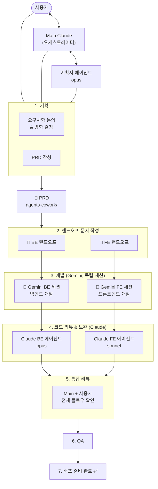

# Development Flow - Agent Orchestration

```mermaid
flowchart TB
    %% Actors
    User([사용자])
    Main["Main Claude<br/>(오케스트레이터)"]
    Planner["기획자 에이전트<br/>opus"]

    %% Phase 1: Planning
    subgraph phase1["1. 기획"]
        direction LR
        P1["요구사항 논의<br/>& 방향 결정"]
        P2["PRD 작성"]
    end

    User <--> Main
    Main <--> Planner
    User --- phase1
    Main --- phase1
    Planner --- phase1
    phase1 --> PRD["📄 PRD<br/>agents-cowork/"]

    %% Phase 2: Handoff
    subgraph phase2["2. 핸드오프 문서 작성"]
        direction LR
        HBE["📄 BE 핸드오프"]
        HFE["📄 FE 핸드오프"]
    end

    PRD --> phase2

    %% Phase 3: Gemini Development
    subgraph phase3["3. 개발 (Gemini, 독립 세션)"]
        direction LR
        GBE["🤖 Gemini BE 세션<br/>백엔드 개발"]
        GFE["🤖 Gemini FE 세션<br/>프론트엔드 개발"]
    end

    HBE --> GBE
    HFE --> GFE

    %% Phase 4: Code Review
    subgraph phase4["4. 코드 리뷰 & 보완 (Claude)"]
        direction LR
        CBE["Claude BE 에이전트<br/>opus"]
        CFE["Claude FE 에이전트<br/>sonnet"]
    end

    GBE --> CBE
    GFE --> CFE

    %% Phase 5: Integration Review
    subgraph phase5["5. 통합 리뷰"]
        Review["Main + 사용자<br/>전체 플로우 확인"]
    end

    CBE --> phase5
    CFE --> phase5

    %% Phase 6-7
    phase5 --> QA["6. QA"]
    QA --> Deploy["7. 배포 준비 완료 ✅"]
```
