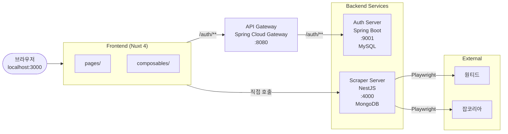

# Service Architecture

```mermaid
flowchart LR
    Browser([브라우저<br/>localhost:3000])

    subgraph frontend["Frontend (Nuxt 4)"]
        Pages["pages/"]
        Composables["composables/"]
    end

    Gateway["API Gateway<br/>Spring Cloud Gateway<br/>:8080"]

    subgraph backend["Backend Services"]
        Auth["Auth Server<br/>Spring Boot<br/>:9001<br/>MySQL"]
        Scraper["Scraper Server<br/>NestJS<br/>:4000<br/>MongoDB"]
    end

    subgraph external["External"]
        Wanted["원티드"]
        JobKorea["잡코리아"]
    end

    Browser --> frontend
    frontend -->|/auth/**| Gateway
    Gateway -->|/auth/**| Auth
    frontend -->|직접 호출| Scraper
    Scraper -->|Playwright| Wanted
    Scraper -->|Playwright| JobKorea
```
