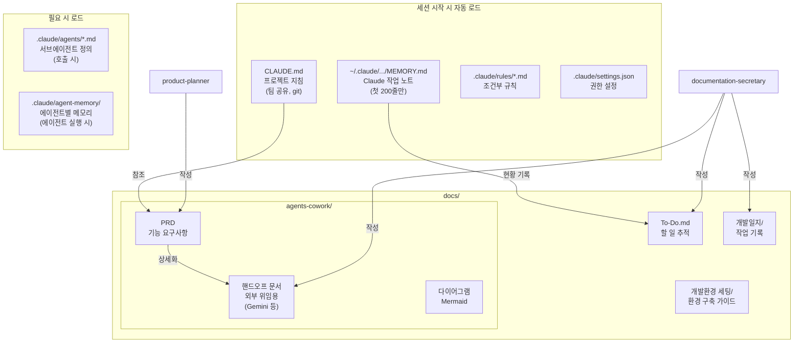

# Document Structure

```mermaid
flowchart TB
    subgraph auto_load["세션 시작 시 자동 로드"]
        CLAUDE["CLAUDE.md<br/>프로젝트 지침<br/>(팀 공유, git)"]
        MEMORY["~/.claude/.../MEMORY.md<br/>Claude 작업 노트<br/>(첫 200줄만)"]
        RULES[".claude/rules/*.md<br/>조건부 규칙"]
        SETTINGS[".claude/settings.json<br/>권한 설정"]
    end

    subgraph on_demand["필요 시 로드"]
        AGENTS[".claude/agents/*.md<br/>서브에이전트 정의<br/>(호출 시)"]
        AGENT_MEM[".claude/agent-memory/<br/>에이전트별 메모리<br/>(에이전트 실행 시)"]
    end

    subgraph docs["docs/"]
        TODO["To-Do.md<br/>할 일 추적"]
        DEVLOG["개발일지/<br/>작업 기록"]
        SETUP["개발환경 세팅/<br/>환경 구축 가이드"]

        subgraph cowork["agents-cowork/"]
            PRD["PRD<br/>기능 요구사항"]
            HANDOFF["핸드오프 문서<br/>외부 위임용<br/>(Gemini 등)"]
            DIAGRAMS["다이어그램<br/>Mermaid"]
        end
    end

    CLAUDE -->|"참조"| PRD
    PRD -->|"상세화"| HANDOFF
    MEMORY -->|"현황 기록"| TODO
    DOC_SEC["documentation-secretary"] -->|작성| DEVLOG
    DOC_SEC -->|작성| TODO
    DOC_SEC -->|작성| HANDOFF
    PP["product-planner"] -->|작성| PRD
```
